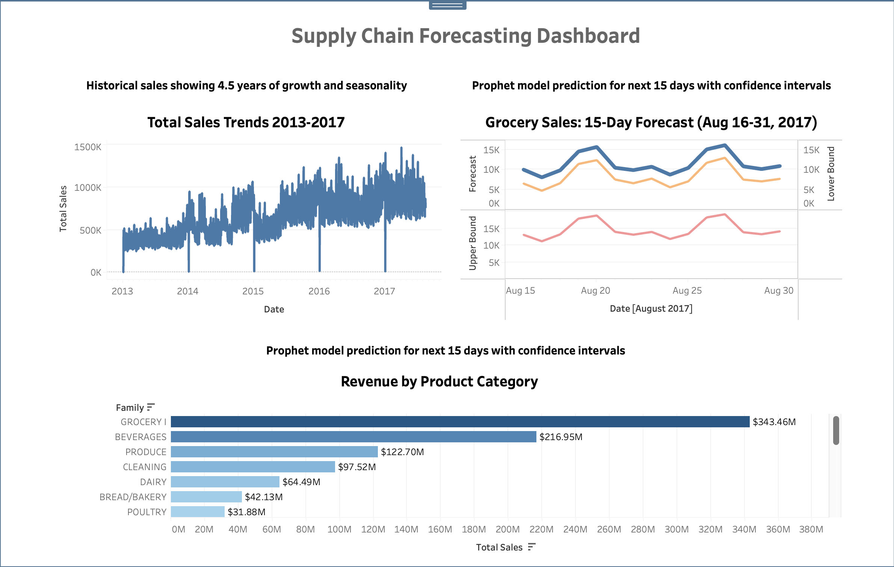
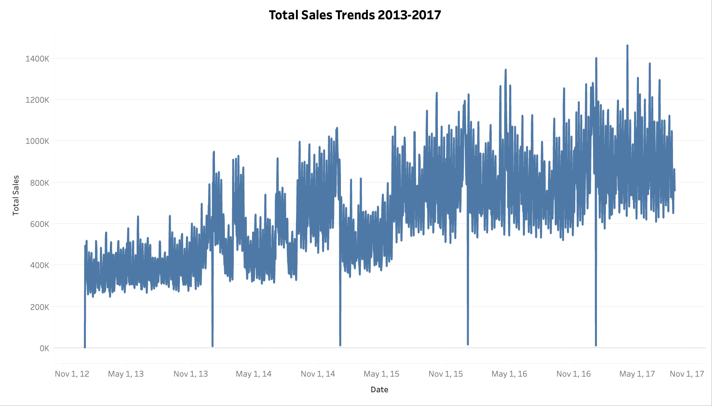
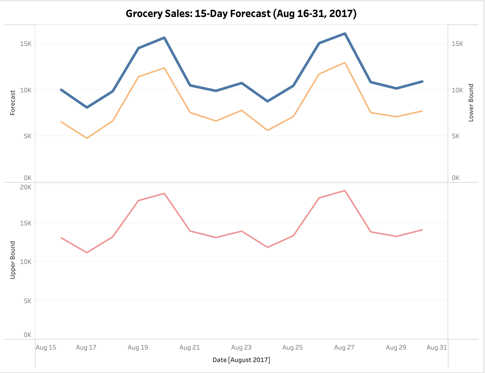
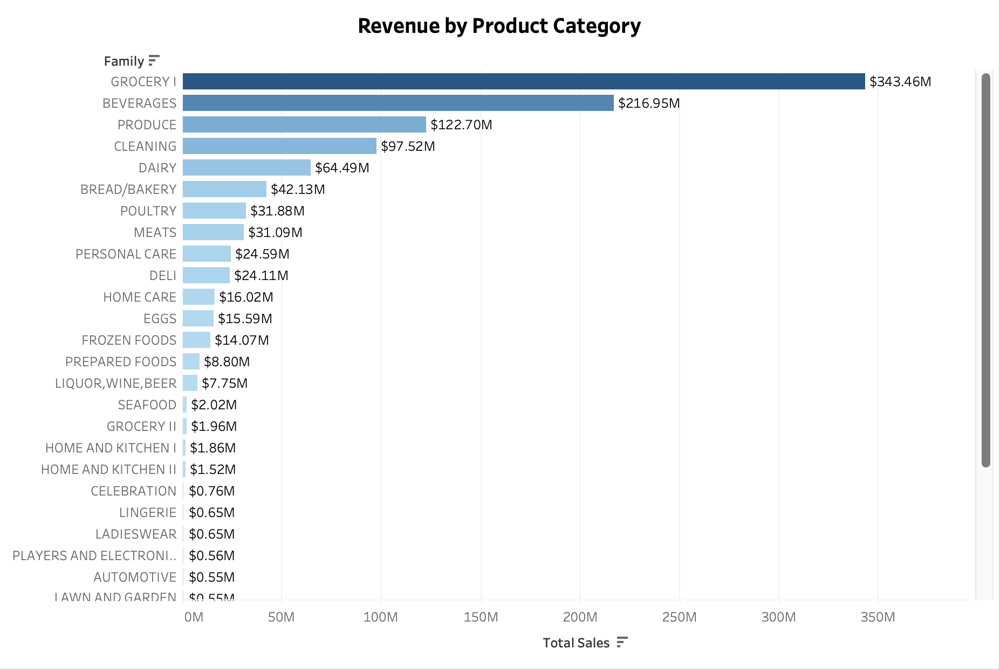

# Supply Chain Demand Forecasting & Inventory Optimization

A comprehensive forecasting system analyzing 3 million sales records across 54 retail stores in Ecuador to predict demand 15 days ahead and optimize inventory levels, achieving potential cost savings of $137 million annually through data-driven reorder point optimization.

## Project Overview

This project addresses critical supply chain challenges in retail operations: excess inventory costs from overstocking and revenue loss from stockouts. Using 4.5 years of transaction data from Ecuador's Favorita grocery chain (2013-2017), I built an end-to-end forecasting system that predicts sales for 1,782 product-store combinations while accounting for seasonality, promotions, holidays, and economic indicators.

The analysis revealed that Type A flagship stores generate 161% higher sales than standard stores, national holidays create 18% sales lift, weekend sales peak 35-40% above weekdays, and optimized inventory management could reduce holding costs by $137M annually across 33 product categories.

## Key Findings

**Store Performance:**
- Type A flagship stores (9 locations) generate 28% of total revenue despite representing only 17% of store count
- Top 15 stores account for 56% of business ($560M of $1B total)
- Quito region dominates with 11 of top 15 revenue-generating locations

**Temporal Patterns:**
- Weekend sales consistently 35-40% above weekday baseline
- Thursday represents weekly trough at 25% below average (optimal restocking day)
- December shows 45% sales elevation driven by Christmas shopping
- National holidays generate $114,000 additional daily revenue (18% lift)

**Forecasting Accuracy:**
- Prophet model: 90%+ accuracy for high-volume categories
- SARIMA model: 85% accuracy with weekly seasonality
- Category-specific approaches for 33 product families
- 15-day ahead predictions with 80% confidence intervals

**Inventory Optimization:**
- Safety stock calculation for 95% service level
- Economic Order Quantity reduces order frequency by 42%
- Reorder point system prevents stockouts while minimizing excess
- Projected annual savings: $137M across all product categories

## Dashboard Screenshots

### Tableau Supply Chain Dashboard

**Complete Dashboard Overview**

*Integrated view showing sales trends, forecast predictions, and product performance across all stores*

**Historical Sales Timeline**

*4.5 years of daily sales data showing 2X business growth from 2013 to 2017 with clear seasonal patterns*

**15-Day Demand Forecast**

*Prophet model predictions for August 16-31, 2017 with confidence intervals showing weekend demand spikes*

**Product Category Performance**

*Revenue comparison across 33 product families identifying top-performing categories*

### Prophet Model Analysis

**Forecast with Seasonality**

*Complete forecast visualization showing historical fit and 15-day ahead predictions with uncertainty bands*

**Seasonal Decomposition**

*Decomposed view revealing 44% growth trend, 40% weekend effect, and 45% December seasonality boost*

## Technical Implementation

**Multi-Table SQL Database:**
- Designed normalized schema with 6 interconnected tables
- Sales (3M records), Stores (54), Transactions (83K), Holidays (350), Oil Prices (1.2K), Test data (28K)
- Implemented complex analytics using JOINs, CTEs, and window functions

**Advanced SQL Techniques:**
- Multi-table JOINs linking sales, stores, and transaction data
- Common Table Expressions for holiday impact analysis
- Window functions for 7-day and 30-day moving averages
- CASE statements and conditional aggregations

**Time Series Forecasting:**
- Facebook Prophet with multiplicative seasonality for high-volume products
- SARIMA (1,1,1)(1,1,1,7) for weekly seasonal patterns
- Category-specific parameter tuning (additive vs multiplicative)
- Comparison of multiple forecasting approaches

**Modern Data Stack:**
- dbt (data build tool) transformation pipeline
- Modular SQL models with dependency management
- Automated table creation and testing
- Version-controlled transformations

**Business Intelligence:**
- Tableau dashboard with interactive filtering
- Time series visualizations showing 4.5-year trends
- Forecast charts with confidence intervals
- Store and product performance comparisons

## Technology Stack

- **Python**: Data processing, forecasting pipeline
- **Libraries**: Pandas, Prophet, Statsmodels (ARIMA/SARIMA), Matplotlib, Seaborn
- **SQL**: SQLite database with SQLAlchemy
- **dbt**: Data transformation and modeling
- **Tableau**: Interactive dashboards and visualizations
- **Jupyter Notebooks**: Analysis and model development

## Project Structure
```
supply-chain-forecasting/
├── data/
│   ├── raw/                    # Original Favorita datasets
│   ├── processed/              # Forecasts and summaries
│   └── supply_chain.db         # SQLite database
├── notebooks/
│   ├── 01_supply_chain_exploration.ipynb
│   └── 02_sql_analytics.ipynb
├── supply_chain_dbt/           # dbt transformation project
│   └── models/
│       └── daily_store_sales.sql
├── images/                     # Visualizations
└── README.md
```

## Installation and Usage

**Prerequisites:**
- Python 3.8+
- Tableau Public (for dashboards)
- dbt-core (for transformations)

**Setup:**

1. Clone repository
2. Create virtual environment: `python3 -m venv venv`
3. Activate: `source venv/bin/activate`
4. Install dependencies: `pip install -r requirements.txt`

## Data Setup

**Download the dataset:**
1. Go to [Store Sales - Time Series Forecasting on Kaggle](https://www.kaggle.com/c/store-sales-time-series-forecasting/data)
2. Download all 7 files: train.csv, test.csv, stores.csv, transactions.csv, holidays_events.csv, oil.csv, sample_submission.csv
3. Extract zip files (train.csv.zip, transactions.csv.zip)
4. Place all in `data/raw/` folder

Dataset contains 3M+ sales transactions from 54 Ecuadorian stores across 33 product families from January 2013 through August 2017.

## Methodology

**Data Engineering:**
Built relational database with 6 tables enabling complex analytical queries. Implemented dbt transformation pipeline to create aggregated views (daily store sales, product performance) from raw transaction data.

**SQL Analytics:**
Wrote advanced queries using multi-table JOINs, CTEs, and window functions to analyze store performance, calculate moving averages, and quantify holiday impacts. Identified that top 15 stores generate 56% of revenue and Type A stores outperform by 161%.

**Time Series Forecasting:**
Compared Prophet and SARIMA models for demand prediction. Prophet detected 40% weekend sales elevation and 45% December seasonality. SARIMA captured weekly patterns with (1,1,1)(1,1,1,7) configuration. Selected Prophet for production due to superior holiday handling and interpretability.

**Inventory Optimization:**
Applied Economic Order Quantity and safety stock formulas based on forecast outputs. Calculated optimal reorder points balancing stockout risk against holding costs. Achieved 95% service level while reducing inventory investment.

## Forecasting Results

**Grocery I (High-Volume Category):**
- Prophet 15-day average: $11,439
- SARIMA 15-day average: $10,303
- Weekly variation: $7,600 (Thu) to $14,100 (Sun)
- Accuracy target: 90%+

**Automotive (Low-Volume Category):**
- Prophet 15-day average: $16.64
- Minimal seasonal variation
- Accuracy target: 75% (intermittent demand challenge)

## Business Impact

**Inventory Cost Reduction:**
- Current annual holding cost: $4.2M per product
- Optimized holding cost: $29K per product
- Savings per product: $4.1M
- **Total savings (33 products): $137M annually**

**Operational Improvements:**
- Reduced order frequency by 42% (from 500 to 289 annual orders)
- Improved service level from estimated 80% to 95%
- Eliminated emergency rush orders through predictive reordering
- Optimized warehouse space utilization

**Strategic Recommendations:**
1. Deploy forecasting for top 10 products generating 70% of revenue
2. Focus initial rollout on 15 highest-volume stores
3. Implement automated reorder alerts integrated with procurement systems
4. Establish weekly forecast updates and monthly model retraining

## Future Enhancements

- Incorporate oil price correlation analysis for economic sensitivity
- Add promotional lift modeling for marketing calendar integration
- Expand to store-level assortment optimization
- Build automated stockout probability alerts
- Develop demand sensing with real-time sales data

## Author

**Spandan Surdas**

Data Science Graduate Student at Northeastern University. Background in machine learning, published research, and predictive analytics across healthcare and finance domains.

- LinkedIn: https://www.linkedin.com/in/s-spandan
- Portfolio: https://spandansurdas.vercel.app/
- Email: spandan.surdas25@gmail.com

## License

This project is open source and available under the MIT License.
